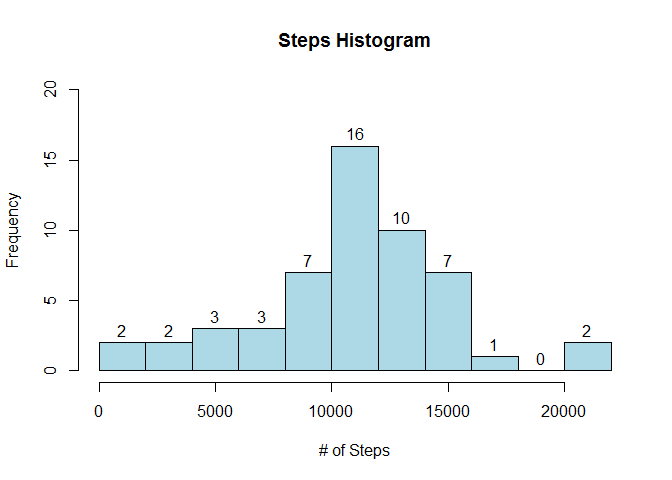
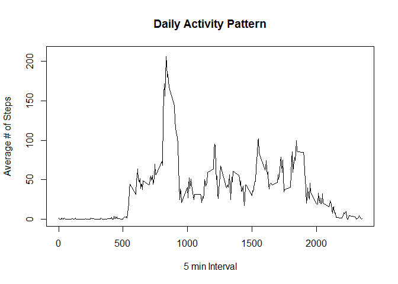
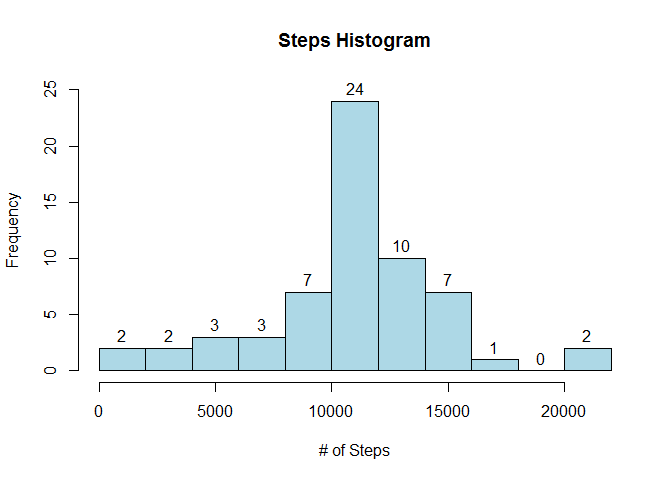
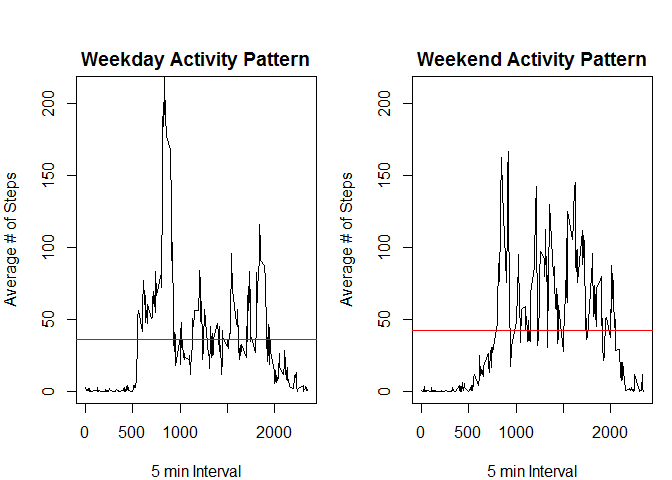

# Reproducible Research: Peer Assessment 1


## Loading and preprocessing the data
In order to complete the requirements of the assignment there is some prep work which needs to be completed so that is the first thing that is done.


```r
library(dplyr)
require(knitr)
opts_chunk$set(echo = TRUE, cache = TRUE, cache.path = "cache/", fig.path = "figure/")
```

The first thing that needs to be done is to unzip the activity.zip file which
contains the data which will be used in this assignment.


```r
unzip("activity.zip", overwrite = TRUE);
```

The next step is to get an understanding of what the data in this file looks
like. To do this the file will be read and then the first 10 rows will be 
displayed.


```r
actData <- read.csv("activity.csv");
head(actData, 10);
```

```
##    steps       date interval
## 1     NA 2012-10-01        0
## 2     NA 2012-10-01        5
## 3     NA 2012-10-01       10
## 4     NA 2012-10-01       15
## 5     NA 2012-10-01       20
## 6     NA 2012-10-01       25
## 7     NA 2012-10-01       30
## 8     NA 2012-10-01       35
## 9     NA 2012-10-01       40
## 10    NA 2012-10-01       45
```

## What is mean total number of steps taken per day?
To determine the total number of steps taken per day the sum will be taken
of the data set grouped by day. 


```r
actData_byDaySum <- actData %>% group_by(date) %>% summarise_each(funs(sum))
actData_byDaySum
```

```
## Source: local data frame [61 x 3]
## 
##          date steps interval
## 1  2012-10-01    NA   339120
## 2  2012-10-02   126   339120
## 3  2012-10-03 11352   339120
## 4  2012-10-04 12116   339120
## 5  2012-10-05 13294   339120
## 6  2012-10-06 15420   339120
## 7  2012-10-07 11015   339120
## 8  2012-10-08    NA   339120
## 9  2012-10-09 12811   339120
## 10 2012-10-10  9900   339120
## ..        ...   ...      ...
```

Now that the sum is calculated by day, a histogram can be created to look at 
the distribution of steps per day.


```r
hist(actData_byDaySum$steps, breaks=8, main="Steps Histogram", ylab="Frequency", xlab="# of Steps", col="lightblue", labels=TRUE, ylim=c(0,20))
```

 

From the histogram above it is clear that the highest level of frequency is in the 10,000-15,000 range. 

Next a summary of the data will be considered with the focus being specifically on the values in steps.

The mean for the daily number of steps with the NA values being excluded is below:


```r
format(round(mean(actData_byDaySum$steps, na.rm=TRUE),0), nsmall=0)
```

```
## [1] "10766"
```

The median for the daily number of steps with the NA values being excluded is below:


```r
format(round(median(actData_byDaySum$steps, na.rm=TRUE),0), nsmall=0)
```

```
## [1] "10765"
```

## What is the average daily activity pattern?
To answer the question of what the average daily activity pattern is, the data must
first be grouped by interval.


```r
actData_byIntMean <- actData %>% group_by(interval) %>% summarise_each(funs(mean(., na.rm=TRUE)))
actData_byIntMean
```

```
## Source: local data frame [288 x 3]
## 
##    interval     steps date
## 1         0 1.7169811   31
## 2         5 0.3396226   31
## 3        10 0.1320755   31
## 4        15 0.1509434   31
## 5        20 0.0754717   31
## 6        25 2.0943396   31
## 7        30 0.5283019   31
## 8        35 0.8679245   31
## 9        40 0.0000000   31
## 10       45 1.4716981   31
## ..      ...       ...  ...
```

With the data now grouped, a time series plot can be created showing the average number of steps over time.
This provides a visual of the individuals activity levels throughout the day.


```r
plot.ts(x=actData_byIntMean$interval, y=actData_byIntMean$steps, ylim=c(0,210), type="l", main="Daily Activity Pattern", xlab="5 min Interval", ylab="Average # of Steps")
```

 

Next the average maximum 5-minute interval will be found based on the number of steps.


```r
actData_byIntMean$interval[which.max(actData_byIntMean$steps)]
```

```
## [1] 835
```

## Imputing missing values
Looking at the data in the activity.csv file, there are a number of gaps. Below is a calculation of exactly how many NA values there are.


```r
sum(is.na(actData$steps))
```

```
## [1] 2304
```

With 2304 NA values our results may be skewed. To improve the results, NA values will be repalced by the average for that interval across all days. The assumption with this strategy is that the individual has a typical daily pattern that can be leveraged.


```r
actDataFilled <- actData
for(i in 1:nrow(actDataFilled)) {
        if(is.na(actDataFilled$steps[i])){
                meanSteps <- actData_byIntMean$steps[actData_byIntMean$interval==actDataFilled$interval[i]]
                actDataFilled$steps[i] <- meanSteps
        }
}
head(actDataFilled,10)
```

```
##        steps       date interval
## 1  1.7169811 2012-10-01        0
## 2  0.3396226 2012-10-01        5
## 3  0.1320755 2012-10-01       10
## 4  0.1509434 2012-10-01       15
## 5  0.0754717 2012-10-01       20
## 6  2.0943396 2012-10-01       25
## 7  0.5283019 2012-10-01       30
## 8  0.8679245 2012-10-01       35
## 9  0.0000000 2012-10-01       40
## 10 1.4716981 2012-10-01       45
```

Now that the NA values have been replaced it is time to calculate the total number of steps per day again.


```r
actDataFilled_byDaySum <- actDataFilled %>% group_by(date) %>% summarise_each(funs(sum))
actDataFilled_byDaySum
```

```
## Source: local data frame [61 x 3]
## 
##          date    steps interval
## 1  2012-10-01 10766.19   339120
## 2  2012-10-02   126.00   339120
## 3  2012-10-03 11352.00   339120
## 4  2012-10-04 12116.00   339120
## 5  2012-10-05 13294.00   339120
## 6  2012-10-06 15420.00   339120
## 7  2012-10-07 11015.00   339120
## 8  2012-10-08 10766.19   339120
## 9  2012-10-09 12811.00   339120
## 10 2012-10-10  9900.00   339120
## ..        ...      ...      ...
```

Next a histogram will be created to see if it has changed with the NA values being replaced.


```r
hist(actDataFilled_byDaySum$steps, breaks=8, main="Steps Histogram", ylab="Frequency", xlab="# of Steps", col="lightblue", labels=TRUE, ylim=c(0,25))
```

 

Finally, the mean and median will be calculated so the values can be compared and any conclusions can be drawn.

First the mean is calculated.


```r
format(round(mean(actDataFilled_byDaySum$steps, na.rm=TRUE),0), nsmall=0)
```

```
## [1] "10766"
```

Then the median is calculated.


```r
format(round(median(actDataFilled_byDaySum$steps, na.rm=TRUE),0), nsmall=0)
```

```
## [1] "10766"
```

As can be seen, there is really no difference in the results. In the historgram we see a slightly higher frequency around the mean values but the mean and median themselves are essentially unchanged. It seems taht the strategy of using the interval average to fill NA values has simply brought the NA values closer to the mean and thus made the center more pronounced.

## Are there differences in activity patterns between weekdays and weekends?
The final anlaysis which is going to be completed is to compare the activity on weekdays versus weekends to see if there is a difference.

The first step will be to create a new factor variable which will categorize each day as either a weekday or a weekend.


```r
actDataFilled$dayType <- weekdays(as.Date(as.character(actDataFilled$date),"%Y-%m-%d")) %in% c('Saturday','Sunday')
actDataFilled$dayType <- ifelse(actDataFilled$dayType,"weekend","weekday")
head(actDataFilled,10)
```

```
##        steps       date interval dayType
## 1  1.7169811 2012-10-01        0 weekday
## 2  0.3396226 2012-10-01        5 weekday
## 3  0.1320755 2012-10-01       10 weekday
## 4  0.1509434 2012-10-01       15 weekday
## 5  0.0754717 2012-10-01       20 weekday
## 6  2.0943396 2012-10-01       25 weekday
## 7  0.5283019 2012-10-01       30 weekday
## 8  0.8679245 2012-10-01       35 weekday
## 9  0.0000000 2012-10-01       40 weekday
## 10 1.4716981 2012-10-01       45 weekday
```

Now that the days are categorized the mean number of steps for each interval can be calculated grouped by the day type and the interval.


```r
actDataFilled_byIntMean <- actDataFilled %>% group_by(dayType, interval) %>% summarise_each(funs(mean), c(steps))
head(actDataFilled_byIntMean,10)
```

```
## Source: local data frame [10 x 3]
## Groups: dayType
## 
##    dayType interval      steps
## 1  weekday        0 2.25115304
## 2  weekday        5 0.44528302
## 3  weekday       10 0.17316562
## 4  weekday       15 0.19790356
## 5  weekday       20 0.09895178
## 6  weekday       25 1.59035639
## 7  weekday       30 0.69266247
## 8  weekday       35 1.13794549
## 9  weekday       40 0.00000000
## 10 weekday       45 1.79622642
```

For this visualization the time series graphs have been put side by side to better show the magnitude of activity at each time. 


```r
windows.options(width=30, height=10)
par(mfrow=c(1,2), mar=c(4,4,2,1), oma=c(0,0,2,0))

plot(x=actDataFilled_byIntMean$interval[actDataFilled_byIntMean$dayType=="weekend"], y=actDataFilled_byIntMean$steps[actDataFilled_byIntMean$dayType=="weekday"], ylim=c(0,210), type="l", main="Weekday Activity Pattern", xlab="5 min Interval", ylab="Average # of Steps")
abline(h=mean(actDataFilled_byIntMean$steps[actDataFilled_byIntMean$dayType=="weekday"]), col="red")

plot(x=actDataFilled_byIntMean$interval[actDataFilled_byIntMean$dayType=="weekend"], y=actDataFilled_byIntMean$steps[actDataFilled_byIntMean$dayType=="weekend"], ylim=c(0,210), type="l", main="Weekend Activity Pattern", xlab="5 min Interval", ylab="Average # of Steps")
abline(h=mean(actDataFilled_byIntMean$steps[actDataFilled_byIntMean$dayType=="weekend"]), col="red")
```

 

There appears to be slightly more overall activity on a weekend although the difference is not all that great. The most significant difference that during the week there is a larger, and earlier, burst of activity and then a more sedatary time. On the weekends the activity starts later and continues at a more consistent pace.

